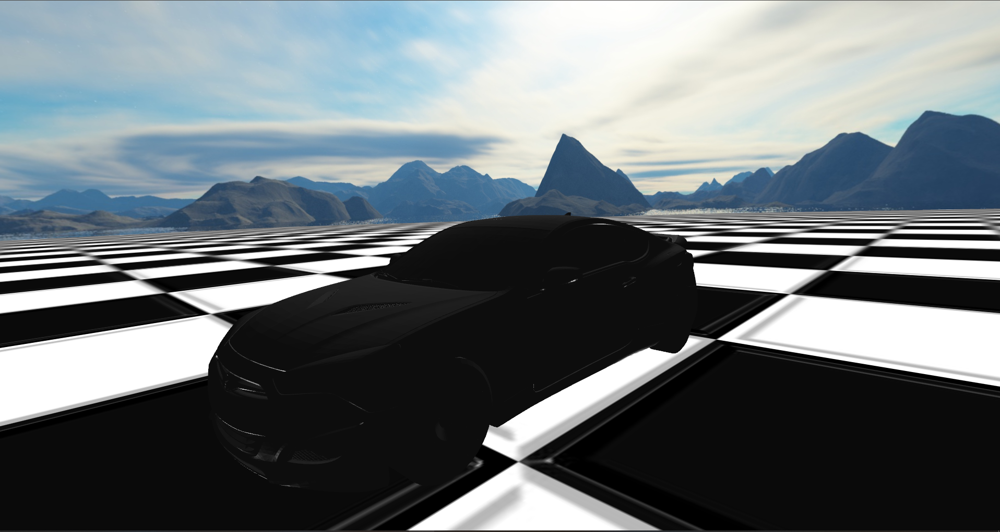

<h1 align="center">Crynn Game Engine</h1>
   

  

## Introduction
   Crynn is an open source game engine created with C++20 and OpenGL.
   Crynn is not overtly user friendly. Knowledge of matrix math, OpenGL and GLFW is required.
   Currently only supports building to Windows.

## Features
- Easy Setup
- Transformation hierarchy (parent child relationships)
- Quaternion rotations. 
- 3D Model loading with [assimp](https://assimp.org/)
- Full rigidbody dynamics with [qu3e](https://github.com/RandyGaul/qu3e).
- Built in Blinn Phong lighting/shading with easily extendable shading options
- Skybox/Cubemapping
- Audio with SFML
- Simple IMGUI integration
- A robust and varied utility library
- Made with C++20
- Fast rendering with OpenGL
- Robust Event and Input System

#### Example Scene Rendered With Crynn

     

## Dependencies
Crynn relies on a multitude of dependencies. They are listed here:

### Crynn Depends On:	

- [GLFW](https://www.glfw.org/) for windowing, and input.
- [GLAD](https://github.com/Dav1dde/glad) for loading OpenGL functions.
- [Dear IMGUI](https://github.com/ocornut/imguiDear) for GUI.
- [GLM](https://glm.g-truc.net/0.9.8/index.html) for matrix and other graphics related mathematics.
- [STB_IMAGE](https://github.com/nothings/stb) for image loading.
- [SFML](https://github.com/SFML/sfml) for audio.
- [qu3e](https://github.com/RandyGaul/qu3e) for rigidbody dynamics.
- [ASSIMP](https://assimp.org/) for 3D model file loading.

# Getting Started:
## Downloading Crynn:
To get started, you will need a copy of the Crynn source. If you have Git installed, you can download Crynn by running this command in the console:
`git clone https://github.com/wmcnamara/crynn.git --recursive`

The dependencies for Crynn are in the lib folder. Make sure you do a recursive clone to fetch submodules.

## Building Crynn:
Crynn previously supported Premake for building the engine, but now only supports building for Visual Studio.

You can download Visual Studio [here.](https://visualstudio.microsoft.com/downloads/)
Visual Studio 2019 is officially recommended.

Once everything is installed, you can follow [these steps](https://github.com/wmcnamara/crynn/wiki/Building-In-Crynn) to build Crynn.

## Using Crynn:
Navigate to the [Github Wiki Page](https://github.com/wmcnamara/crynn/wiki). It will bring you to the introduction page, explaining how to use Crynn.

### Disclaimer
This engine is mostly intended as a personal project to learn more about computer graphics, and create personal games. As such I will not make any guarantees about master branch stability. I'm not always consistent with my styling, and there are some unfinished parts of the engine.
